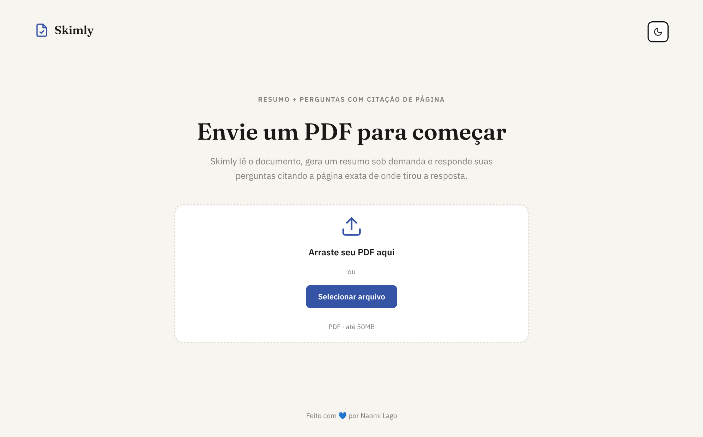

# Skimly

Agente em LangGraph que recebe um PDF, gera um resumo sob demanda e responde perguntas sobre o conteúdo com citação de página.

<div align="center">
  
</div>

## Como rodar (CLI)

```bash
uv sync
uv run main.py
```

Informe o caminho do PDF, depois converse livremente. Digite `resumo` a qualquer momento para ver o resumo do documento, ou `sair` para encerrar.

## Como rodar (interface web)

Backend (API) e frontend rodam como dois processos separados.

```bash
# terminal 1 — API
uv sync
uv run uvicorn api:app --reload --port 8000

# terminal 2 — frontend
cd frontend
npm install
npm run dev
```

Abra o endereço que o Vite mostrar (por padrão `http://localhost:5173`).

## Stack

LangGraph, LangChain, Claude (Anthropic), Voyage AI (embeddings), Chroma (vector store local) e FastAPI (API). Frontend em React + TypeScript + Tailwind CSS.
